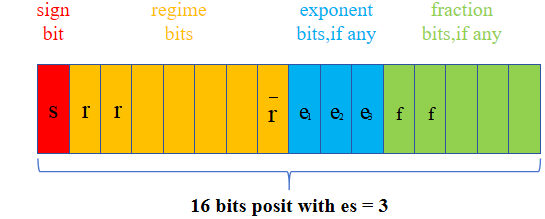

## Posit Number system

For posit number system, it's designed to be hardware-friendly while it can be divided into four parts: Sign, Regime, Exponent and Fraction. And for one specific posit number system, it needs two variables to define, that is **n** and **es**. 
1.	**n** represents the total bits in this system
2. **es** represents the maximum bits of exponent
   
And other format details are as follows:
1.  Sign bit: **S** represents the number is a negative or a positive. If **S = 1**, which represents the number is a negative, we need to take the complement before decoding the subsequent domain at first.
2. Regime bit: This field is unique to the posit system. Because it has a dynamic number of bits, ranging from **1** to **n-1**. The field usually begins with a series of **0s** or **1s** and ends until the remaining bits are used up or when a different bit occurs than the previous one.
3.  Exponent bit: This field represents an unsigned integer number, but it doesn't need to minus an offset which is usually used in IEEE754. Due to the regime field, if there is no remaining bits, then exponent bit is equal to zero. If not, the exponent bit is allowed up to **es** bits.
4.  Fraction bit: This field represents the decimal number. But only if there are remaining bits, it can work. Besides, it's same as the IEEE754 standard, with a hidden bit **1** before the fraction decimal point.

    
     
    
eg. 16_3 posit number system

In our implementation, we apply it for NGP to improve the performance of NGP, and the conclusion are as follows:

Under the IEEE754 floating-point standard, the arithmetic operations with floating-point numbers often generate a significant number of NaNs, while the posit number system yields almost no NaNs in its computation results. This characteristic of posit significantly enhances the precision of calculations. Incorporating a 16-bit posit number system into the Instant NGP results in a reduction of bit width by half. At the same time, it leads to higher or comparable image resolution quality. The use of 12-bit and 10-bit posit number systems further decreases the bit width, albeit with a slight loss in PSNR. Conversely, employing an 8-bit posit number system and a 10-bit fixed-point system results in a substantial decline in the reconstructed image quality, highlighting the advantages of the 10-bit posit through comparative experiments. Concurrently, the reduction in bit width enables the storage and retrieval of data in a smaller memory space, thus lowering the complexity of hardware design and energy costs during memory access operations.

    
     
    
eg. Lego performance when 16_3 posit number system used in NGP 

